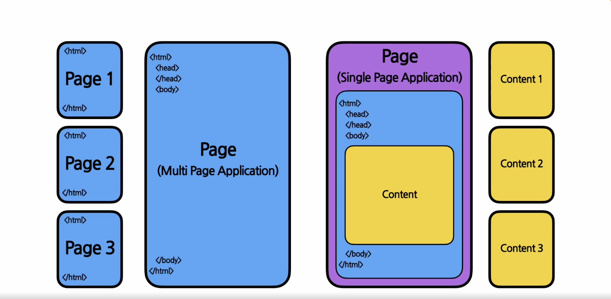

## 준비하기

<br/>

- ### HTML
  - 웹사이트의 뼈대를 구성하기 위해 사용하는 마크업 언어
  - Tag 사용
   ```
   <html>
      <head> //meta data
      </head>
      <body>  //contents(우리가 보게되는 것)
      </body>
   </html>
   ```

  <br/>

   

    - **SPA** : 싱글페이지 어플리케이션
      - 왼쪽 그림은 여러개의 **HTML**파일이 존재
      - 오른쪽 그림은 단 한개의 **HTML**파일만 존재(**SPA**)
        - 동적으로 body tag부분을 채워넣는다(=React)

<br/>

- ### CSS
  - **Design**

<br/>

- ### JavaScript (version : ES6)
  - **script는 런타임에 코드가 실행되고 해석된다**
  - 자료형
    - 동적 타이핑(`var`, `let`로 선언후 자료형은 나중에 결정된다)
    - `let n1 = 1234;` 
     
    - ex)`let arr4 = [true, 1, undefined, false, "h", 2, null, "i"]`
    <br>
    `console.log(arr4[3]) //false `
  - 연산자
    - 대입연산자
    - 사칙연산자
    - 산술연산자
      - ` let a = 2; let b = 4;`<br> `console.log(a**b)` // 16
    - 관계연산자(비교 연산자)
      - 일치연산자
        - ` a === b // a가 b와 값과 자료형이 모두 같다 `
        ``` javascript
        var a = 1;
        var b = "1";
        console.log(a == b); //true
        console.log(a === b); //false
        ```
        
        - ` a !== b // a가 b와 값이나 자료형이 같지 않다`
    - etc

  - 함수
    1) function statement를 사용
      - `function sum(a,b) {return a+b;}` 
    2) arrow function expression 사용
      - `const multiply = (a,b) => {return a*b;}`

<br/>

- ### develop enviroment
  - node.js, npm(package) 설치 
    - 자바스크립트로 네트워크 어플리케이션을 개발 할 수있게하는 환경