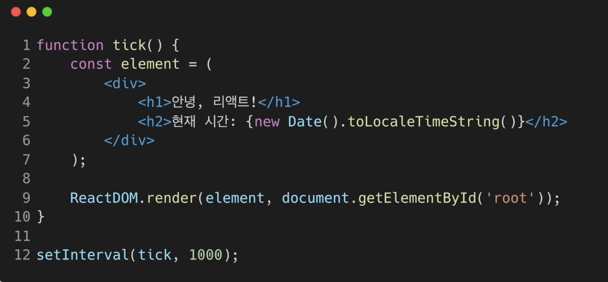

## Elements

- ### Elements 란
  - 리액트 앱을 구성하는 요소
  - 리액트 앱을 구성하는 가장 작은 블록들
    ``` javascript
      React.createElement( //Elements를 생성해주는 함수
        type, //리액트 컴포넌트 or div(HTML tag) 등
        [props],  //리액트 컴포넌트 속성
        [...children] //현재 element가 포함하는 자식 element
      )
    ```
  - **Elements**는 웹사이트의 모든정보를 가지고있는 DOM에서 사용하는 용어<br>
  (밑에 그림은 **DOM Elements**로 리액트 Elements가 아니다) HTML요소를 나타낸다 (**자바스크립트가 아닌**)
  
  
  - React Elements는 화면에서 보이는 것들을 기술
  - **React Elements가 기술한 내용을 토대로 실제 우리가 화면에서 보게되는<br>DOM Elements가 만들어 진다**
  - 앞으로 Elements라고 하고 DOM Elements라고 특정해서 말하지 않는다면<br> React Elements를 의미한다고 생각하자


- ### React Elements VS DOM Elements
  
  
  - 실제 브라우저에 존재하는 **Elements**는 **DOM Elements**
  - **Virtual DOM**에 존재하는 것이 **React Elements**
  - React Elements(많은 정보를 가지고 있다) 는 DOM Elements의 가상표현
  - JSX예제코드를 통한 이해
    - `const element = <h1>Hello, world</h1>;`
    - 이코드가 실행될때 대입연산자의 오른쪽 부분은 `createElement함수`를 사용하여 Elements를 생성하게 된다
    - 그렇게 생성된것이 React Elements(자바스크립트 객체 형태로 존재)
    - React는 이 Elements를 이용하여 실제 화면에서 보게될 DOM Elements를 생성하게 된다
  

- ### Elements의 생김새
  - 리액트 Elements는 자바스크립트 객체 형태로 존재한다
    ``` javascript
      React.createElement( //Elements를 생성해주는 함수
        type, //리액트 컴포넌트 or div(HTML tag) 등
              // 마지막에는 HTML태그가 나온다
        [props],  // Elements 속성
        [...children] //현재 Element가 포함하는 자식 Element
      )
    ```
  - (리액트 Elements는 `createElements함수`를 통해 생성된다)
  - type으로 HTML태그가 들어간 경우의 리액트 Elements 예제
    ``` javascript
    type: 'button' // HTML태그이름이 문자열로 들어간다
                  // Elements는 해당 태그이름을 가진 DOM Node를 나타낸다
    props: {  //속성
      className: 'bg-green',
      children: {
        type: 'b',
        props: {
          children: 'Hello, element!'
        }
      }
    }
    ```
  - 위 Elements가 랜더링이 된다면 나올 DOM Elements
    ``` javascript
    <button class='bg-green'>
      <b>
        Hello, element!
      </b>
    </button>
    ```

- ### React.createElement가 동작하는 과정
  ``` javascript
    function Button(props) {  //Button 컴포넌트
      return (
      <button classname={`bg-${props.color}`}>
        <b>
          {props.children}
        </b>
      </button>
      )
    }

    function ConfirmDialog(props) { //ConfirmDialog 컴포넌트
      return (
        <div>
          <p>내용을 확인하셨으면 버튼을 눌러주세요.</p>
          <Button color='green'>확인</Button> //Button 컴포넌트를 포함하고 있다
        </div>
      )
    }
  ```
  - ConfirmDialog 컴포넌트의 Elements는 밑에와 같은 형태가 된다
  - 컴포넌트 랜더링을 위해서 모든 컴포넌트가 element로 변환된다
    ``` javascript
    type: 'div',
    props: {
      children: [
        {
          type: 'p',
          props: {
            children: '내용을 확인하셨으면 확인 버튼을 눌러주세요.'
          }
        },
        {
          type: 'button',
          props: {
            className: 'bg-green',
            children: {
              type: 'b',
                props: {
                  children: '확인'
            }
        }
      ]
    }
    ```

- ### React Elements의 특징
  - immutable = 불변성
  - **Elements 생성 후**에는 children이나 attributes를 바꿀 수 없다
  - Component = 붕어빵 틀, Element = 붕어빵
  - 불변하니깐 Elements만 새로 만들어서 바꿔치기 하면 되겠다
  - 

    - 각 동그란 원들은 Elements
    - 빨간색 부분은 변경된 Elements들

- ### Elements 렌더링 하기
  `<div id="root"></div> `
  - 이 HTML코드는 root라는 이름을 가진 div 태그이다
  - Root DOM Node(여러개 있을 수 있다)
  - 모든 리액트 앱에 들어가는 필수적인 코드
  - 실제로 div 태그안에 React Elements들이 렌더링 되며, 이것을 Root DOM Node라 한다
  - div 태그안에 있는 모든 것이 React DOM에 의해 관리된다
  - 

  - root div에 실제로 React Elements를 렌더링 하기 위해서는 다음과 같은 코드를 사용한다
    - `const element = <h1>안녕, 리액트!</h1>;`
    - `ReactDOM.render(element, document.getElementById('root'));`
    - 첫번재 파라미터인 React Elements를 두번째 파라미터인 DOM Elements로 렌더링 하는 역할을 한다 **(가상에서 현실로)**
    
- **???**
  - JSX코드를 렌더링하여 HTML코드로 나타내면 어떤식으로 변할까?
  - 
  - 

  - 개발자도구 단축키 : `option + command + i`