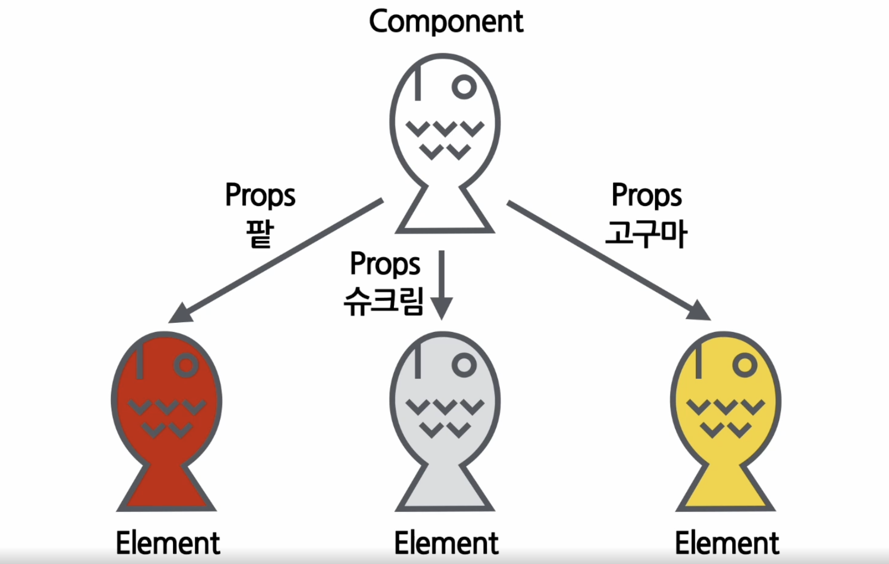
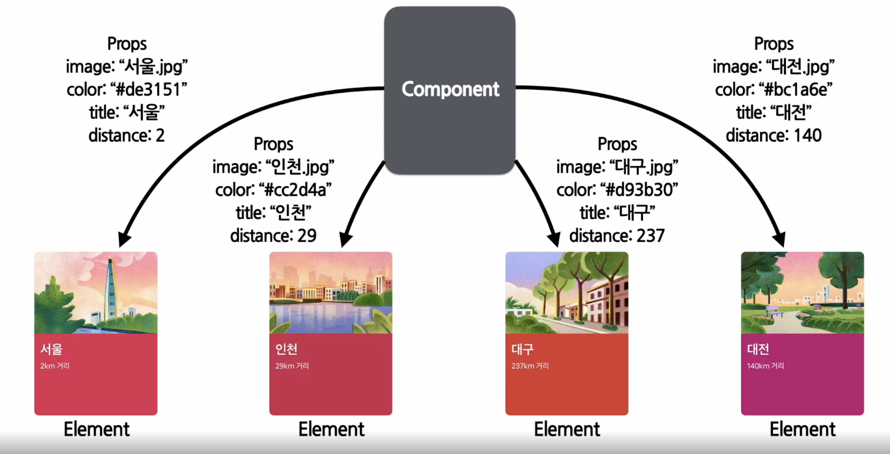
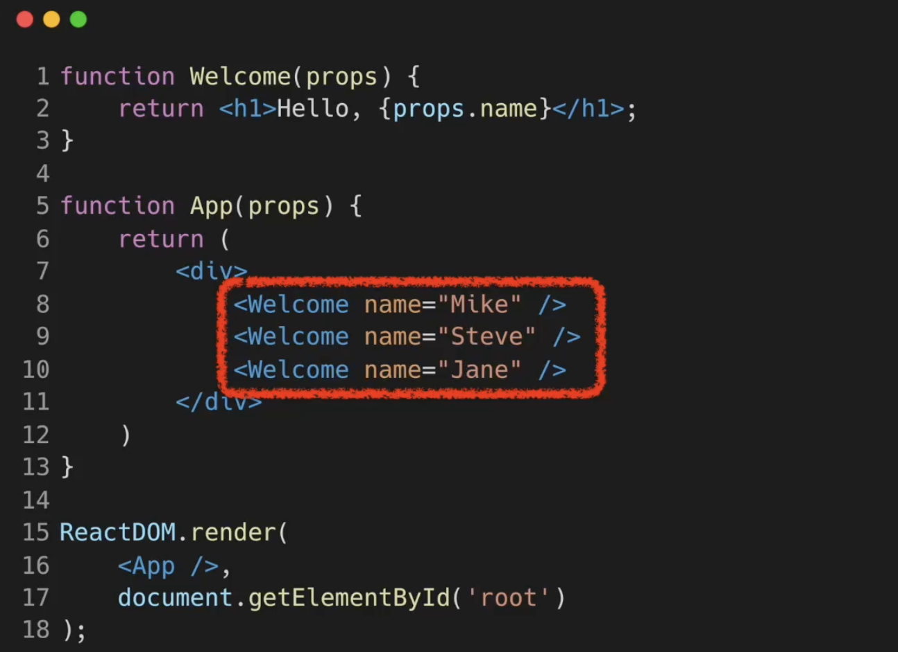
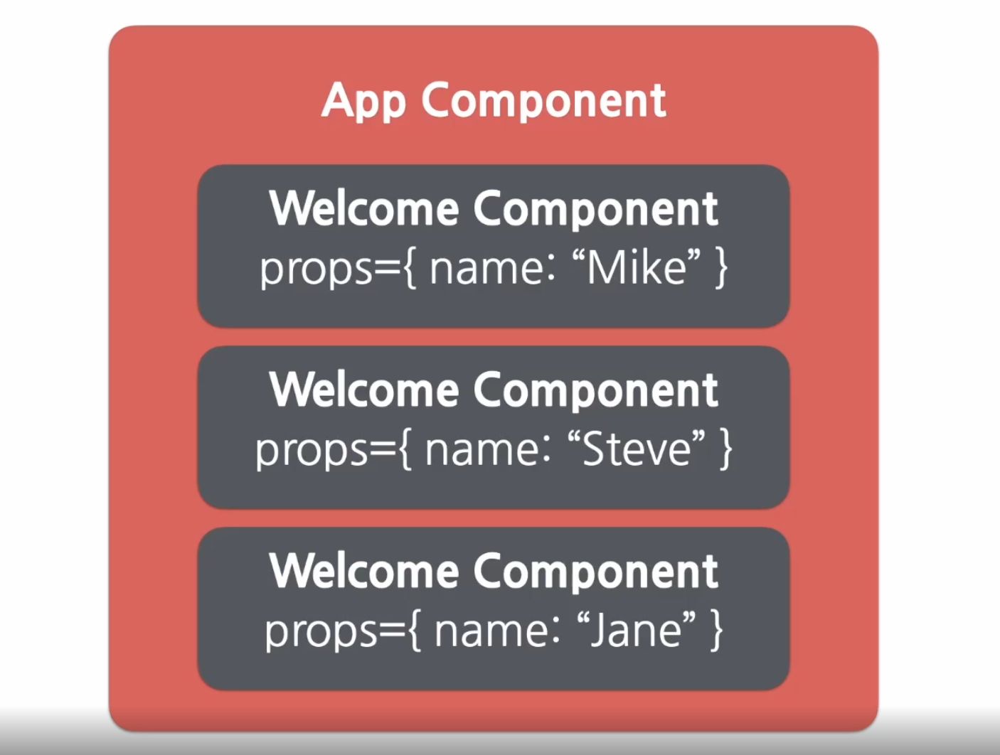

## Components

<br/>
1)

``` javascript
    //Components
    function Button(props) {  //Button 컴포넌트
      return (
      <button classname={`bg-${props.color}`}>
        <b>
          {props.children}
        </b>
      </button>
      )
    }
// ----------------------------------------------------
    //React Elements
    type: 'button' // HTML태그이름이 문자열로 들어간다
                  // Elements는 해당 태그이름을 가진 DOM Node를 나타낸다
    props: {  //속성
      className: 'bg-green',
      children: {
        type: 'b',
        props: {
          children: 'Hello, element!'
        }
      }
    }
// ----------------------------------------------------
    //DOM Elements
    <button class='bg-green'>
      <b>
        Hello, element!
      </b>
    </button>
```

<br/>
2)

``` javascript
  <!-- Component -->
  function Welcome(props){
    return <h1>안녕, {props.name}</h1>;
  }

  <!-- React Element 생성-->
  const element = <Welcome name="인제" />;

  <!-- ReactDOM을 통해 실제 DOM에 나타난다 -->
  ReactDOM.render(
    element,
    document,getElementById('root')
  );
  ```

<br/>

- ### React component
  - 하나의 함수라고 생각하면 쉽다
  


<br/>

- ### Props (components의 입력)
  - component의 속성
    - 붕어빵의 재료
    - 

  - 예시
    - 

  - **컴포넌트에 전달할 다양한 정보를 담고 있는 자바스크립트 객체**

<br/>

- ### Props의 특징
  - Read-Only
  - 값을 변경할 수 없다
  - **pure한 성격을 가지고 있다**
    - 항상 같은 입력은 같은 출력을 초래
    - 같은 Props에는 같은 Elements가 나와야 한다
  
- ### Props 사용법
  ``` javascript
    <!-- JSX를 이용했을때 (적극 추천) -->
    function App(props) {
        return(
          <Profile     <!-- Profile 컴포넌트의 3가지 props를 넣어주었다 -->
            name="소플"
            introduction="안녕하세요,소플입니다"
            viewCount={1500}    <!-- 중괄호를 사용했다: 중괄호를 사용하면 무조건 자바스크립트 코드가 들어간다 
            따라서 문자열 이외에 정수 변수, 컴포넌트같은 다른 자료형이 들어갈 경우에는 중괄호를 해야한다
            문자열도 중괄호로 감싸다 상관없다 -->
          />
        );
    }

    <!-- JSX를 이용하지 않았을 때 -->
    React.createElement(
      Profile,
      {
        name: "소플",
        introduction: "안녕하세요 소플입니다",
        viewCount: 1500
      },
      null
    );
  ```

  ``` javascript
  <!-- 이와같은 자바 스크립트 객체가 된다 -->
  {
    name: "소플",
    introduction: "안녕하세요 소플입니다",
    viewCount: 1500
  }
  ```

<br/>

- ### Component 만들기
  - **Function Component**
    - ``` javascript
      function Welcome(props)
        { 
        return <h1>안녕, {props.name}</h1>;
        }
      ```

  - **Class Component**
    - ``` javascript
      class Welcome extends React.Component{
        render(){
          return <h1> 안녕, {this.props.name}</h1>;
        }
      }
      ```
  - Component이름은 항상 대문자
    - **(소문자로 입력시 HTML tag로 인식)**

<br/>

- ### Component 렌더링
  ``` javascript
  <!-- Component -->
  function Welcome(props){
    return <h1>안녕, {props.name}</h1>;
  }

  <!-- React Element 생성-->
  const element = <Welcome name="인제" />;

  <!-- ReactDOM을 통해 실제 DOM에 나타난다 -->
  ReactDOM.render(
    element,
    document,getElementById('root')
  );
  ```

<br/>

- ### Component 합성
  - 
  - 

<br/>

- ### Component 추출
  - 재사용성, 개발속도 up
  - 큰 Component에서 여러개의 작은 Component로 쪼개자
    - 메서드가 하나의 역할만을 하게하는 것과 비슷