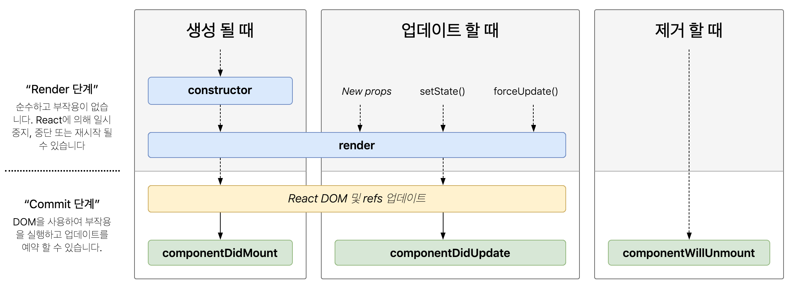

## State와 Lifecycle

<br/>

- ### State
  

  - Component의 상태(데이터)
  - state는 개발자가 정의한다
    - 렌더링이나 데이터흐름에 사용되는 값만 state에 포함시켜야 한다
  - JavaScript 객체

<br/>

- ### Lifecycle
  - React Component의 생명주기
  - Componente가 계속 존재하는 것이 아닌,<br> 시간의 흐름에 따라 생성되고 업데이트되다가 사라진다

<br/>

- ### Class Component에서의 State설정
     ``` javascript
      class LikeButton extends React.Component {
        constructor(props) {  //모든 class Component에는 constructor라는 이름의 함수가 존재하는데 이는, 생성자
          super(props);

          this.state = { //State
            liked: false  //liked라는 boolean 변수를 생성했다
                        //앞으로 사용할 데이터를 state에 넣어 초기화
          };  
        }
      }
      ...

    ```

  - **Function Component**에서는 훅을 이용

<br/>

- ### Class Component Lifecycle
  - React Component의 생명주기
  - 리액트 클래스 컴포넌트의 생명주기
  

  - 밑에 녹색들은 Class Component의 생명주기 함수
    - 요즘에는 거의 안씀
  - Component가 계속 존재하는 것이 아닌,<br> 시간의 흐름에 따라 생성되고 업데이트되다가 사라진다
