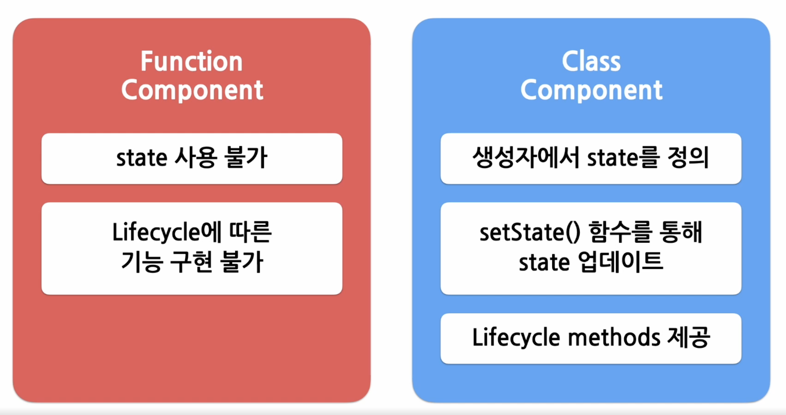

## Hooks

<br/>

- ### Hooks
  


  

  - Hooks 을 사용하면 함수 컴포넌트도 클래스 컴포넌트와 동일하게
  <br> **모든 기능을 사용 가능**

<br/>

- ### useState (state와 동일한 기능)
  - state를 사용하기 위한 Hook

     ``` javascript
    import React, { useState} from "react";
    function Counter(props) {
      var count = 0;

      return(
        <div>
          <p>총 {count}번 클릭했습니다.</p>
          <button onClick={() => count++)}>
              클릭
          </button>
        </div>
      )
    }
    ```

  - count를 함수의 변수로 선언해 사용하게 되면, 버튼클릭시 count값을 증가시킬수는 있지만 <br> 재렌더링이 일어나지않아 카운트값이 화면에 표시되지 않는다

  - useState사용방법 :  `const [변수명, set함수명] = useState(초기값);`
  - 리턴값으로 배열이 나온다
  - 변수 각각에 대해 set함수가 존재

    ``` javascript
    import React, { useState} from "react";
    function Counter(props) {
      const [const, setCount] = useState(0);

      return(
        <div>
          <p>총 {count}번 클릭했습니다.</p>
          <button onClick={() => setCount(count + 1)}>
              클릭
          </button>
        </div>
      )
    }
    ```
    - 값이 바뀔때마다 재렌더링된다


<br/>

- ### useEffect (생명주기 함수와 동일한 기능)
  - Side effect(효과, 영향)를 수행하기 위한 Hook
  - Side effect는 다른 컴포넌트에 영향을 미칠 수 있으며, <br>렌더링 중에는 작업이 완료될 수 없기 때문에 side로 실행되어야 한다
  - `useEffect(이펙트 함수, 의존성 배열);`
  - 의존성 배열은 말 그대로 이 이펙트 함수가 의존하고 있는 배열
    - 배열안에 있는 값중 하나라도 값이 변경되면 이펙트함수가 실행된다
    - 이펙트 함수가 mount, unmount시에 단 한번씩만 실행되게 하려면
      - `useEffect(이펙트 함수, [])`
      - 어느것에도 의존하지 않는다
    - 의존성배열을 생략하게 되면 컴포넌트가 업데이트 될 때마다 호출된다
      - useEffect(이펙트 함수);

     ``` javascript
      import React, { useState, useEffect } from "react"

      function Counter(props) {
        const [count, setCount] = useState(0);

        //componentDidMount, componentDidUpdate(생명주기함수)와 비슷하게 동작한다
        useEffect(() => {
          //브라우저 API를 사용해서 document의 title을 업데이트 한다
          // 처음 mount 될때와 update가 될 때마다 갱신된다
          document.title = 'You clicked ${count} times';
        });
        return (
          <div>
            <p>총 {count}번 클릭했습니다. </p>
            <button onClick={() => setCount(count+1)}>
                클릭
            </button>
          </div>
        );
      }

      ```

  - ```javascript
    useEffect(() => {
      // 컴포넌트가 마운트 된 이후,
      // 의존성 배열에 있는 변수들 중 하나라도 값이 변경되었을 때 실행됨
      // 의존성 배열에 빈 배열([])을 넣으면 마운트와 언마운트 시에 단 한번씩만 실행됨
      // 의존성 배열 생략 시 컴포넌트 업데이트 시마다 실행됨
      ...

      return () => {
        // 컴포넌트가 마운트 해제되기 전에 실행됨
        ...
      }
    }, [의존성 변수1, 의존성 변수2, ...])
    ```

<br/>


