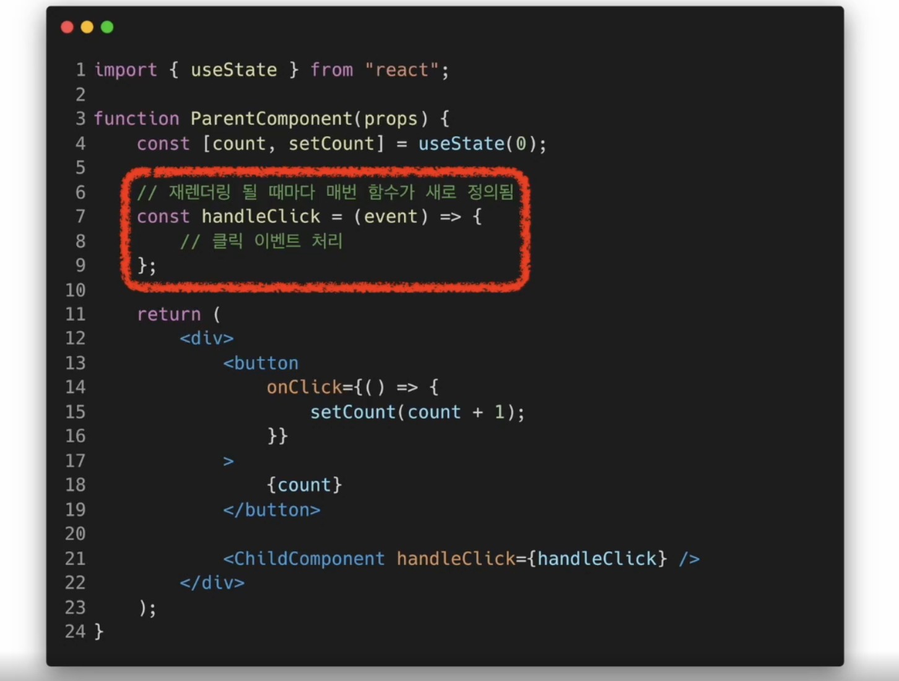
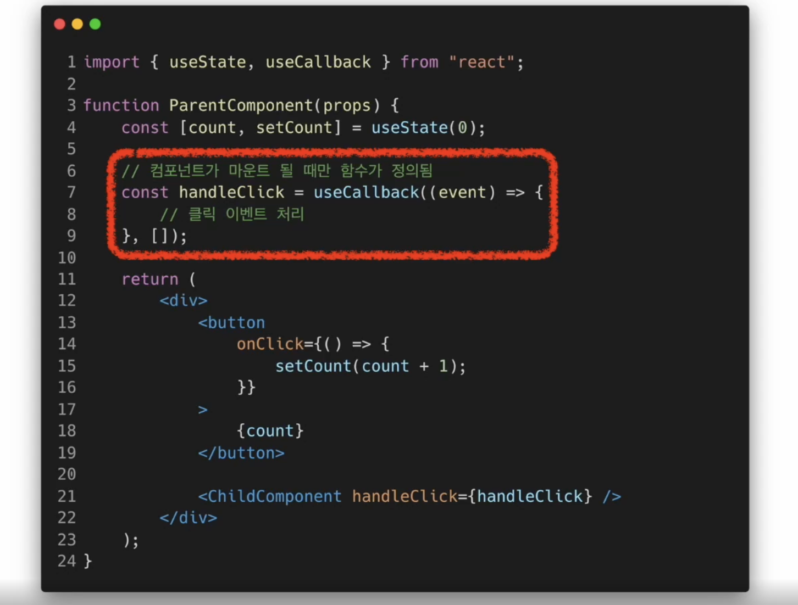
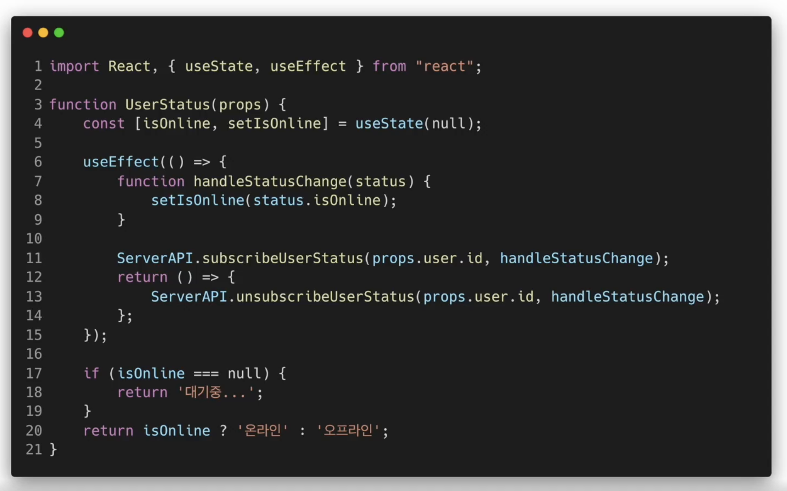
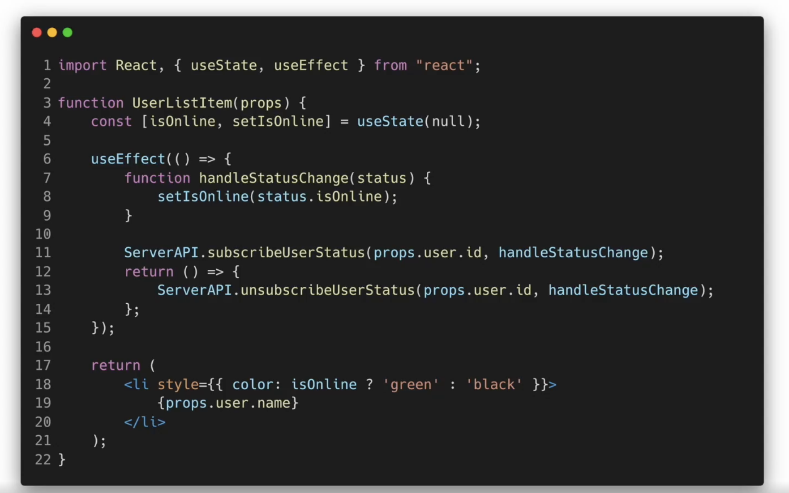
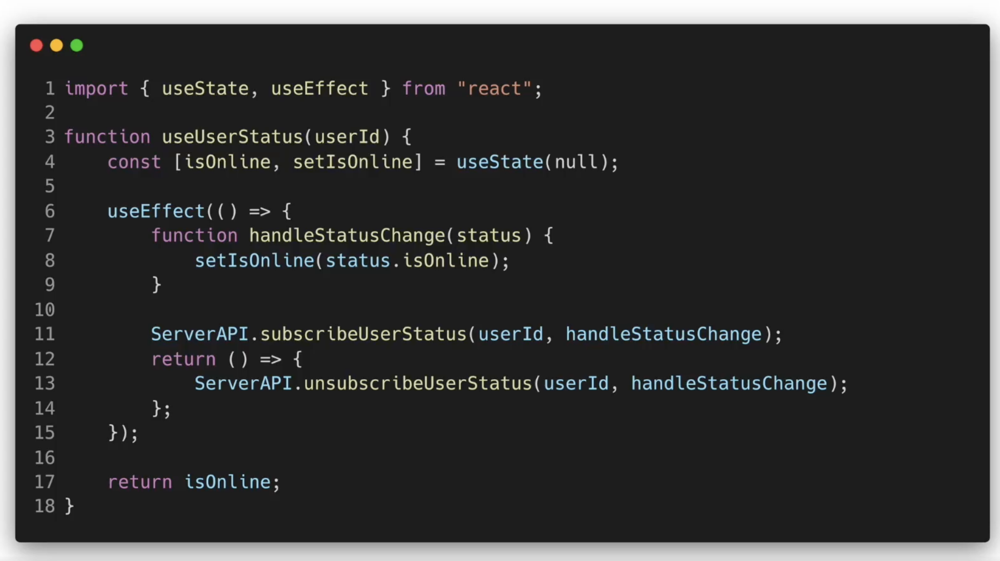
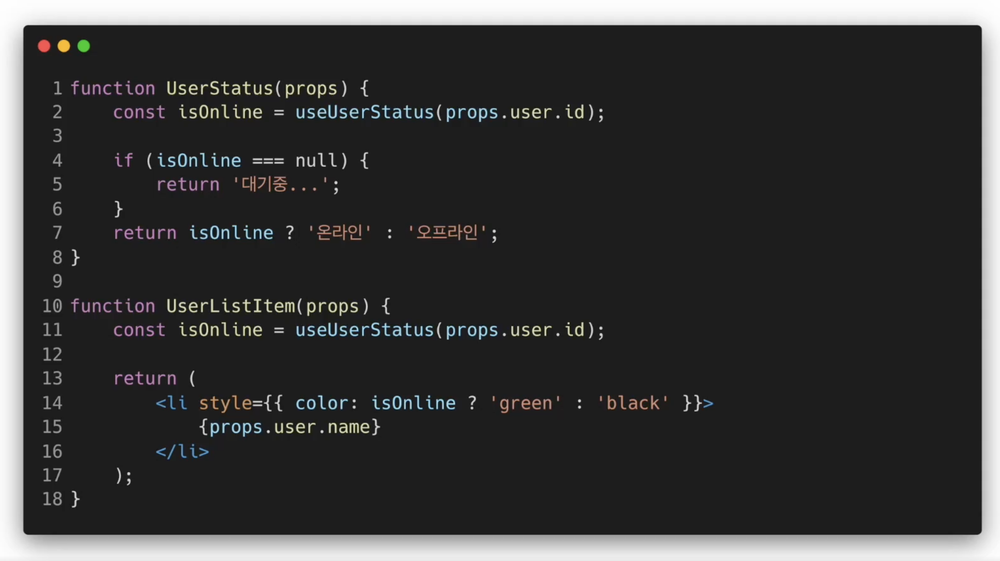
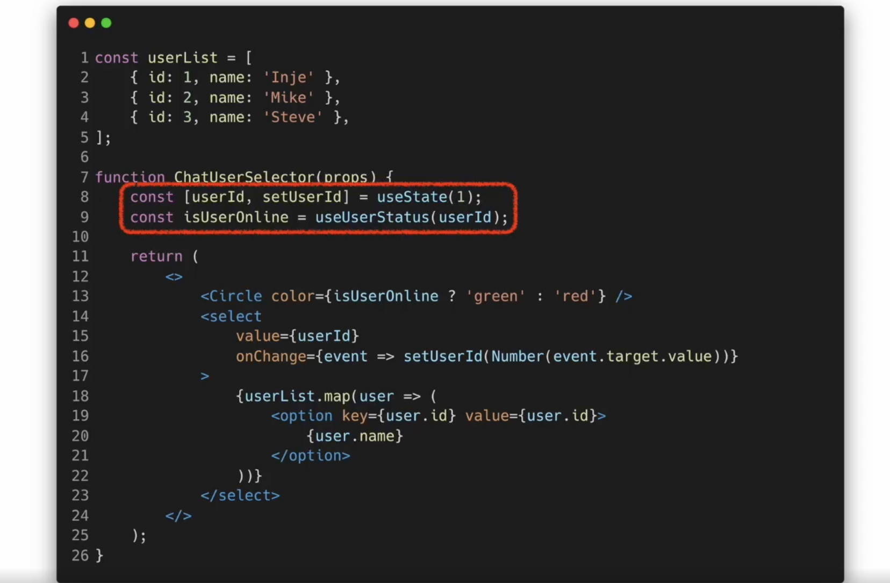

## Hooks

<br/>

- ### Hooks
  


  

  - Hooks 을 사용하면 함수 컴포넌트도 클래스 컴포넌트와 동일하게
  <br> **모든 기능을 사용 가능**

<br/>

- ### useState (state와 동일한 기능)
  - state를 사용하기 위한 Hook

     ``` javascript
    import React, { useState} from "react";
    function Counter(props) {
      var count = 0;

      return(
        <div>
          <p>총 {count}번 클릭했습니다.</p>
          <button onClick={() => count++)}>
              클릭
          </button>
        </div>
      )
    }
    ```

  - count를 함수의 변수로 선언해 사용하게 되면, 버튼클릭시 count값을 증가시킬수는 있지만 <br> 재렌더링이 일어나지않아 카운트값이 화면에 표시되지 않는다

  - `useState`사용방법 :  `const [변수명, set함수명] = useState(초기값);`
  - 리턴값으로 배열이 나온다
  - 변수 각각에 대해 set함수가 존재

    ``` javascript
    import React, { useState} from "react";
    function Counter(props) {
      const [const, setCount] = useState(0);

      return(
        <div>
          <p>총 {count}번 클릭했습니다.</p>
          <button onClick={() => setCount(count + 1)}>
              클릭
          </button>
        </div>
      )
    }
    ```
    - 값이 바뀔때마다 재렌더링된다


<br/>

- ### useEffect (생명주기 함수와 동일한 기능)
  - Side effect(효과, 영향)를 수행하기 위한 Hook
  - Side effect는 다른 컴포넌트에 영향을 미칠 수 있으며, <br>렌더링 중에는 작업이 완료될 수 없기 때문에 side로 실행되어야 한다
  - `useEffect(이펙트 함수, 의존성 배열);`
  - 의존성 배열은 말 그대로 이 이펙트 함수가 의존하고 있는 배열
    - 배열안에 있는 값중 하나라도 값이 변경되면 이펙트함수가 실행된다
    - 이펙트 함수가 `mount, unmount`시에 단 한번씩만 실행되게 하려면
      - `useEffect(이펙트 함수, [])`
      - 어느것에도 의존하지 않는다
    - 의존성배열을 생략하게 되면 컴포넌트가 업데이트 될 때마다 호출된다
      - `useEffect(이펙트 함수)`;

     ``` javascript
      import React, { useState, useEffect } from "react"

      function Counter(props) {
        const [count, setCount] = useState(0);

        //componentDidMount, componentDidUpdate(생명주기함수)와 비슷하게 동작한다
        useEffect(() => {
          //브라우저 API를 사용해서 document의 title을 업데이트 한다
          // 처음 mount 될때와 update가 될 때마다 갱신된다
          document.title = 'You clicked ${count} times';
        });
        return (
          <div>
            <p>총 {count}번 클릭했습니다. </p>
            <button onClick={() => setCount(count+1)}>
                클릭
            </button>
          </div>
        );
      }

      ```

  - ```javascript
    useEffect(() => {
      // 컴포넌트가 마운트 된 이후,
      // 의존성 배열에 있는 변수들 중 하나라도 값이 변경되었을 때 실행됨
      // 의존성 배열에 빈 배열([])을 넣으면 마운트와 언마운트 시에 단 한번씩만 실행됨
      // 의존성 배열 생략 시 컴포넌트 업데이트 시마다 실행됨
      ...

      return () => {
        // 컴포넌트가 마운트 해제되기 전에 실행됨
        ...
      }
    }, [의존성 변수1, 의존성 변수2, ...])
    ```

<br/>

- ### useMemo() - value(값)반환
  - Memoized value(저장해 놓았던 호출 결과)를 리턴하는 Hook
  ```javascript
      const memoizedValue = useMemo(
        () => {
          //연산량이 높은 작업을 수행하여 결과를 반환
          //의존성 변수에 값이 변경될때만 새로운 값을 반환 원래는 기존의 값만 반환
          // 이 함수는 렌더링이 일어날 동안 일어난다
          return computeExpensiveValue(의존성 변수1, 의존성 변수2);
        },
        [의존성 변수1, 의존성 변수2]
      );
  ```

  - `useMemo()`를 사용하면 컴포넌트가 렌더링 될 때 마다 연산량이 높은 작업을 피할 수 있다
    - -> 빠른 렌더링 속도

  - ```javascript
      const memoizedValue = useMemo(
        () => computeExpensiveValue(a, b)
      )
    ```

    - 의존성 배열을 넣지 않을 경우, 매 렌더링마다 함수가 실행된다
    - 이건 useMemo()를 사용하는 이유랑 맞지 않아서 아무 의미가 없다

  - ```javascript
    const memoizedValue = useMemo(
      () => {
        return computeExpensiveValue(a,b);
      },
      []
    );
    ```
    - 의존성 배열이 빈 배열일 경우, 컴포넌트 마운트 시에만 호출됨
      - 즉, 값이 바뀌지 않는다

<br/>

- ### useCallback() - function(함수)반환
  - Memoized value(저장해 놓았던 호출 결과)를 리턴하는 Hook
  - `useMemo()` Hook과 유사하지만 값이 아닌 함수를 반환
  - 컴포넌트가 렌더링 될 때마다 매번 함수를 새로 정의하는 것이 아닌, <br> 의존성 배열에 값이 바뀐 경우에만 함수를 새로 정의하고 리턴
  ```javascript
  const memoizedCallback = useCallback(
    () => {
      doSomething(의존성 변수1, 의존성 변수2);
    },
    [의존성 변수1, 의존성 변수2]
  );
  ```

  - 
  - 

<br/>

- ### useRef()
  - 특정 컴포넌트에 접근할 수 있는 객체(자바스크립트 객체)리턴(클래스의 인스턴스변수와 유사)
  ```javascript
  const refContainer = useRef(초깃값);
  ```
  - 해당초깃값으로 초기화된 `reference객체`를 반환한다
    - 초깃값이 null이라면 해당 객체의 `current`값은 null인 상태로 반환
  - `useRef Hook` => 변경가능한 `current`라는 속성을 가진 하나의 상자를 만든다

  ``` javascript
    function TextInputWithFocusButton(props) {
      const inputElem = useRef(null);

      const onButtonClick = () => {
        // current는 마운트된 input element를 가리킴
        inputElem.current.focus();
      };

      return (
        //inputElem을 input tag에 넣어주었다
        // button Click시 inputElem에 접근하여 focus함수 호출
        <>
          <input ref={inputElem} type="text"/>
          <button onClick={onButtonClick}>
            Focus the input
          </button>
        </>
      );
    }
  ```
  
<br/>
  
  - `<div ref = {myRef} />` 
    - 원래 사용했던 것처럼 DOM에 접근하기 위해 사용되는 `ref 속성`과 기능 유사
    - 리액트에서 위에처럼 코드를 작성하면,<br> 노드가 변경될 때 마다 `myRef`의 current속성에 현재 해당되는 DOM Node를 저장한다

  - `useRef() Hook`은 내부의 데이터가 변경되었을 때 별도로 알리지 않는다.
    - `current속성`을 변경한다고 해서 재렌더링이 일어나지는 않는다
    - 따라서, ref의 DOM Node가 연결되거나 분리되었을 때의 어떤 코드를 실행하고 싶다면 `Callback ref`를 사용해야 한다
      - DOM Node의 변화를 아는 가장 기초적인 방법
  ```javascript
  function MeasureExample(props) {
    const [height, setHeight] = useState(0);

    const measuredRef = useCallback(node => {
      if(node !== null) {
        setHeight(node.getBoundingClientRect().height);
      }
    }, []);
    return (
      <>
        <h1 ref={measuredRef}>안녕, 리액트</h1>
        <h2>위 헤더의 높이는 {Math.round(height)}px 입니다 </h2>
      </>
    );
  }

<br/>

- ### HOOK의 규칙
  - Hook은 무조건 최상위 레벨에서만 호출해야 한다
  - 잘못된 Hook 사용법
    - ```javascript
      function MyComponent(props) {
        const [name, setName] = useState('Inje');

        if(name !== '') {
          useEffect(() => {
            ...
          });
        }
        ...
      }
      ```
      - 렌더링 될때마다 Hook이 같은순서대로 호출되는 것이 아니게 된다
  - 리액트 함수 컴포넌트에서만 Hook을 호출해야 한다
  - `eslint-plugin-react-hooks` : 리액트 훅에 도움되는 패키지

<br/>

- ### Custom Hook 만들기
  - 이름이 use로 시작하고 내부에서 다른 Hook을 호출하는
  <br> 하나의 자바스크립트 함수
  - 중복되는 logic을 Custom Hook으로 추출
    - 
    - 
    - 
  
  - 

  - 각 Custom Hook 호출에 대해서 분리된 state를 얻게 됨
  - 각 Custom Hook의 호출 또한 완전히 독립적이다

<br/>

- ### Hook들 사이에서 데이터 공유하는 방법
  - 

    - `useState`를 통해 생성된 `state(userId)`가 `useUserStatus`의 파라미터로 들어간다
    - `setUserId`로 갱신될때마다 `useUserStatus` 훅의 인자 값이 바뀜
