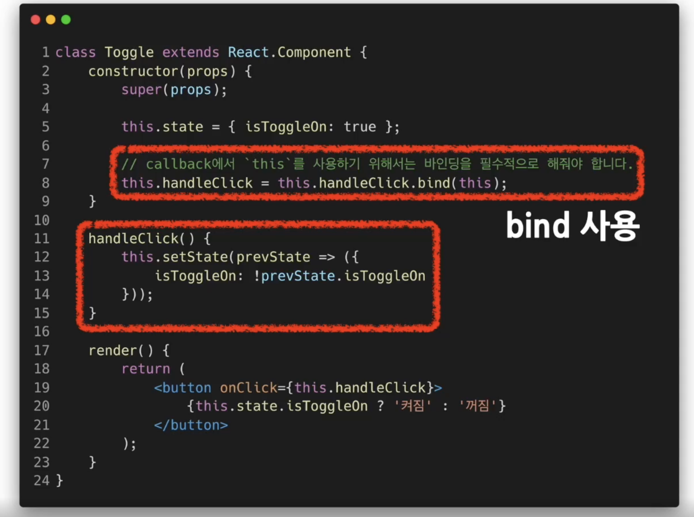
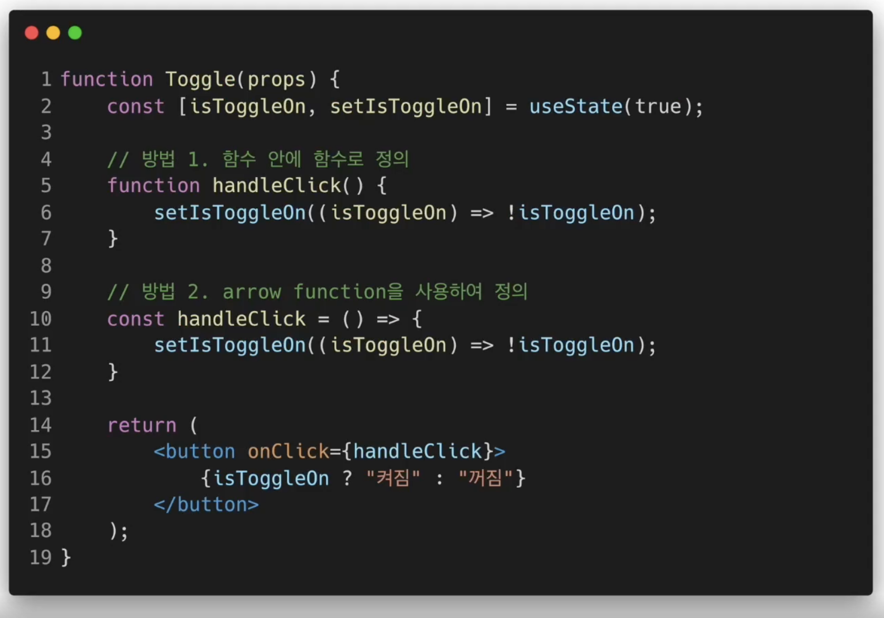
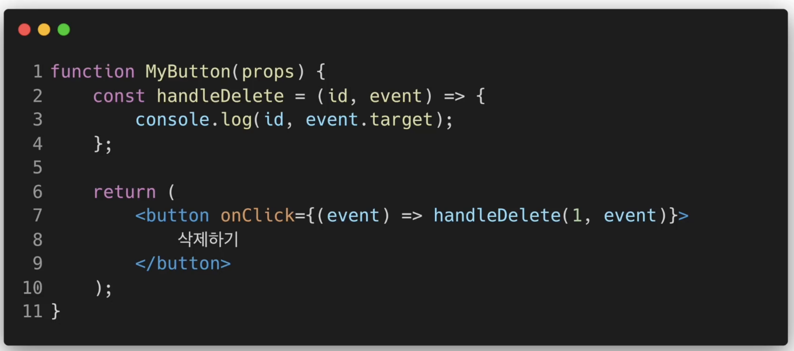

## Handling Events

<br/>


- ### Event
  - 사건
    - ex) 사용자가 버튼을 클릭하는 이벤트

<br/>

- ### DOM의 이벤트(React가 아닌)
  ``` javascript
  <button onclick="activate()">
    Activate
  </button>
  ```
  - 버튼이 눌리면 activate함수가 호출되게 구성

<br/>

- ### React의 Event 처리
  ``` javascript
    <button onClick={activate}>
    //onClick : 카멜표기법
      Activate
    </button>
  ```
  - DOM과 달리 처리할 함수를 문자열로 전달하는 것이 아닌 <br> 함수 이름 그대로 전달
  
<br/>

- ### Event Handler(Class component)
  - 
  - callback이란: 다름 함수가 끝날때까지 기다리는 것

<br/>

- ### Event Handler(Function component)
  - function 컴포넌트
  - 

<br/>

- ### Arguments
  - function component 예제
  - 