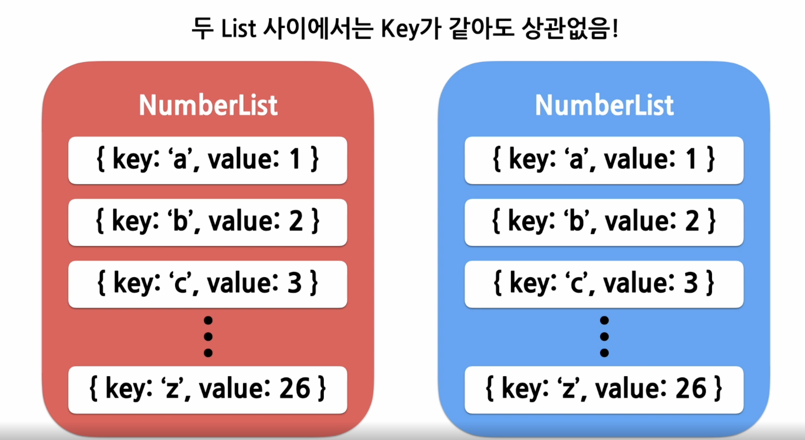

## List & Key

<br/>


- ### List
  - 목록
  - Array
  
<br/>

- ### Key
  - 열쇠
  - 각 객체나 아이템을 구분할 수 있는 고유한 값

<br/>

- ### 여러개의 Component 렌더링 하기
  - `map()`
    - `const doubled = number.map((number) => number*2);`

  ``` javascript
  function NumberList(props) {
    const { numbers } = props;

    const listItems = numbers.map((number) => 
      <li>{number}</li>
    );

    return (
      <ul>{listItems}</ul>
    );

    const numbers = [1,2,3,4,5];
    ReactDOM.render(
      <NumberList numbers={numbers} />,
      document.getElementById('root')
    );
  }

  //각 리스트는 고유한 키를 가지고있어야 한다는 경고문이 출력됨
  ```
  

<br/>

- ### List 의 Key
  

  - key로 값을 사용하는경우
    ```javascript
    const numbers = [1,2,3,4,5];
    const listItems = numbers.map((number)) =>
      <li key = {number.toString()}>  //numbers의 값들이 중복되지 않은 경우에만 사용가능
        {number}
      </li>
    ```  

  - key로 id를 사용하는 경우(권장)
    ```javascript
    const todoItems = todos.map((todo)) =>
      <li key = {todo.id}>
        {todo.text}
      </li>
    ```  

  - key로 index를 사용하는경우
    ``` javascript
    const todoItems = todos.map((todo, index)) =>
      <li key={index}>  //배열내에서의 현재 item의 index를 key값으로
      //기본적으로 리액트에서는 key를 명시적으로 넣어주지(ex:id) 않으면 이 index값을 key값으로 사용
        {todo.text}
      </li>
    ```

  - **map() 함수안에 있는 Elements는 꼭 key가 필요하다**


<br/>
