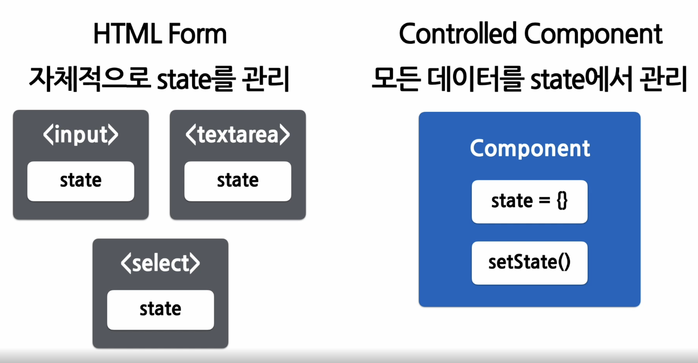

## Form & Controlled Component

<br/>


- ### Form
  - 양식
  - 사용자로부터 입력을 받기 위해 사용

  
<br/>

- ### HTML Form
  ```html
  <form>
    <label>
      이름 : 
      <input type="text" name="name" />
    </label>
    <button type="submit">제출</button>
  </form>
  ```

<br/>

- ### Controlled Components
  - 값이 리액트의 통제를 받는 Input Form Elements

  - 
    - HTML Form의 경우 자바스크립트 코드를 통해 각각의 값에 접근하기가 어렵다
    
<br/>

- ### React Form
  ```javascript
  function NameForm(props) {
    const [value, setValue] = useState(' ');

    const handleChange = (event) => {
      setValue(event.target.value); //해당 타겟의 value속성(target : input element, value : input element의 값)
    }
    const handleSubmit = (event) => {
      alert('입력한 이름' + value);
      event.preventDefault();
    }

    return (
      <form onSubmit={handleSubmit}>
        <label>
          이름 :
          <input type = "text" value={value} onChange={handleChange} />
        </label>
        <button type="submit">제출</button>
      </form>
    )
  }
  ```
  - Controlled Component를 사용하면 입력값이 Component의 state를 통해 관리된다

<br/>

- ### 다양한 Forms
  - Textarea 태그
    - 여러줄에 걸쳐 긴 텍스트를 입력받기 위한 HTML 태그
    ``` html
    <!-- HTML textarea 태그 -->
    <textarea>  
      안녕하세요, 여기에 이렇게 텍스트가 들어갑니다
    </textarea>
    ```
    
  ``` javascript
  //React form
  function RequestForm(props){
    const [value, setValue] = useState('요청사항을 입력하세요');

    const handleChange = (event) => {
      setValue(event.target.value);
    }

    const handleSubmit = (event) => {
      alert('입력한 요청사항 : '+ value);
      event.preventDefault();
    }

    return (
      <form onSubmit={handleSubmit}>
        <label>
          요청사항:
          <textarea value={value} onChange={handlChange} />
        </label>
        <button type="submit">제출</button>
      </form>
    )
  }
  ```
  <br/>

  - Select 태그
    - Drop-down 목록을 보여주기 위한 HTML 태그    


  - File input 태그
    - 디바이스의 저장장치로부터 하나 또는 여러개의 파일을 선택할 수 있게 해주는 HTML태그
    - `<input type ="file" />`  
    - **Uncontrolled Component** (File input태그는 그 값이 읽기전용으로 값이 react의 통제를 받지 못한다)  

<br/>

- ### Input Null Value
  - 입력값을 바꾸는 방법
  - value props은 넣돼, 자유롭게 값을 변경하고 싶다면 -> 사용자가 값을 맘대로 넣을 수 있다
  ``` javascript
  ReactDOM.render(<input value="hi" />,rootNode);

  setTimeout(function()){
    ReactDOM.render(<input value={null} />, rootNode);  //입력가능한 상태
  },1000);
  ```


<br/>

