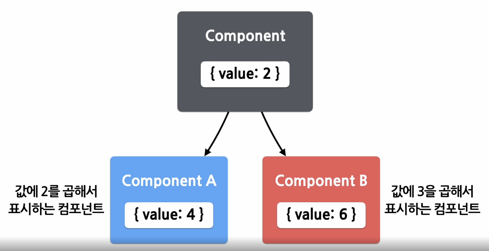
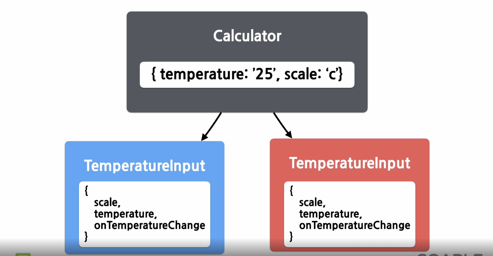

## Lifting State Up

<br/>


- ### Lifting State Up
  - 여러개의 컴포넌트에서 state를 공유
  
<br/>

- ### Shared State
  - State에 있는 데이터를 여러개의 하위 컴포넌트에서 공통적으로 사용하는 경우
  
``` javascript

1)
//섭씨온도를 props로 받아서 물이 끓는지 안끓는지를 출력하는 컴포넌트
function BoilingVerdict(props) {
  if (props.celsius >= 100) {
    return <p>물이 끓습니다</p>;
  }
  return <p>물이 끓지 않습니다</p>;
}


2)

//state로 온도를 가지고 있고, 사용자로부터 입력을 받기 위한 input 태그
//사용자가 온도를 변경할 때 마다 handlChange함수가 호출

function Calculator(props) {
  const [temperature, setTemperature] = useState('');

  const handleChange = (event) => {
    setTemperature(event.target.value);
  }

  return(
    <fieldset>
      <legend> 섭씨온도를 입력하세요 : </legend>
      <input
        value = {temperature}
        onChange = {handleChange} />
      <BoilingVerdict
        celsius = {parseFloat(temperature)} />
    </fieldset>
  )
}

3)
//입력 컴포넌트 추출하기
const scaleNames = {
  c : '섭씨',
  f : '화씨'
};

function TemperatureInput(props) {
  const [temperature, setTemperature] = useState('');

  const handleChange = (event) => {
    setTemperature(event.target.value);
  }
  return (
    <fieldset>
      <legend>
        온도를 입력해 주세요(단위 : {scaleNames[props.scale]});
      </legend>
      <input value={temperature} onChange={handleChange} />
    </fieldset>
  )
}

//입력컴포넌트만 따로 빼낸 후의 Calculator 컴포넌트
2-1)
function Calculator(props) {
  return (
    <div>
      <TemperatureInput scale="c" />
      <TemperatureInput scale="f" />
    </div>
  )
}
//문제발생
// 사용자가 입력하는 온도 값이 TemperatureInput의 state에 저장되므로
// 섭씨온도와 화씨온도를 따로 입력받으면 두개의 값이 다를수 있다


4)
//섭씨온도와 화씨온도의 동기화를 위해
//온도 변환 함수
function toCelsius(fahrenheit) {
  return (fahrenheit - 32) * 5 /9;
}
function toFahrenheit(celsius) {
  return (celsius * 9 / 5) + 32;
}

5)
//위에 함수를 호출하는 함수
function tryConvert(temperature, convert) {
  const input = parseFloat(temperature);
  if (Number.isNaN(input)){
    return '';
  }

  const output = convert(input);
  const rounded = Math.round(output * 1000) / 1000;
  return rounded.toString();
}
// tryConvert('abc', toCelsius);        empty String 을 리턴
// tryConvert('10.22', toFahrenheit);   '50.396'을 리턴


//Shared State 적용하기 
//하위 컴포넌트의 state를 공통 상위 컴포넌트로 올림 -> lifting state up
3-1)
const scaleNames = {
  c : '섭씨',
  f : '화씨'
};

function TemperatureInput(props) {

  const handleChange = (event) => {
    //변경전setTemperature(event.target.value);
    props.onTemperatureChange(event.target.value);
  }
  return (
    <fieldset>
      <legend>
        온도를 입력해 주세요(단위 : {scaleNames[props.scale]});
      </legend>
      //변경전 <input value={temperature} onChange={handleChange} />
      <input value={props.temperature} onChange={handleChange} />
    </fieldset>
  )
}

2-2)
//부모(상위) 컴포넌트 수정 

function Calculator(props) {
  const [temperature, setTemperature] = useState('');
  const [scale, setScale] = useState('c');  

  const handleCelsiusChange = (temperature) => {
    setTemperature(temperature);
    setScaled('c');
  }

  const handleFahrenheitChange = (temperature) => {
    setTemperature(temperature);
    setScaled('f');
  }

  const celsius = scale === 'f' ? tryConvert(temperature, toCelsius) : temperature;
  const fahrenheit = scale === 'c' ? tryConvert(temperature, toFahrenheit) : temperature;

  return (
    <div>
      <TemperatureInput
        scale="c"
        temperature={celsius}
        onTemperatureChange={handleCelsiusChange} />
      <TemperatureInput
        scale="f"
        temperature={fahrenheit}
        onTemperatureChange={handleFahrenheitChange} />
      <BoillingVerdict
        celsius={pasrseFloat(celsius)} />
    </div>
  );
}

```
<br/>


