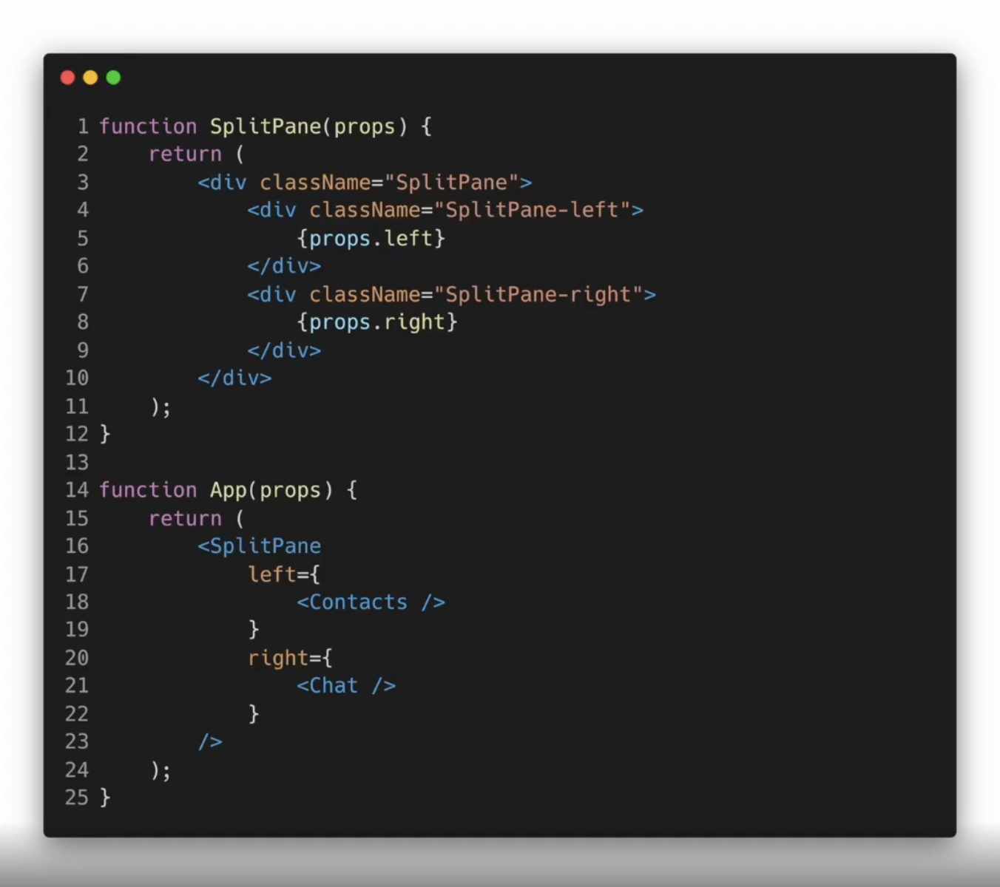

## Composition vs Inheritance

<br/>


- ### Composition
  - 여러개의 컴포넌트를 합쳐서 새로운 컴포넌트를 만든다
  
<br/>

- ### Containment - 1)composition 방법
  - 하위 컴포넌트를 포함하는 형태의 합성방법
  - Sidebar나 Dialog같은 Box형태의 컴포넌트는 자신의 하위 컴포넌트를 미리 알 수 없다.
  - children이라는 prop을 사용해서 조합! (리액트에서 제공)

  ```javascript
  //childeren prop을 사용한 FancyBorder 컴포넌트
  //즉, FancyBorder컴포넌트는 자신의 하위 컴포넌트를 모두포함하여 예쁜테두리로 감싸주는 컴포넌트가 된다
  function FancyBorder(props) {
    return (
      <div className={'FancyBorder FancyBorder-' + props.color}>
        {props.children}  
      </div>
    );
  }
  ```

  ``` javascript
  //FancyBorder 컴포넌트 안에 있는 모든 JSX태그는 children으로 전달됨.
  function WelcomeDialog(props) {
    return (
      <FancyBorder color="blue">
        <h1 className = "Dialog-title">
          어서오세요
        </h1>
        <p className="Dialog-message">
          우리 사이트에 방문하신 것을 환영합니다!
        </p>
      <FancyBorder>
    );
  }
  ```

  - 다른 예제
  
    - `left` 와 `right` 라는 props 설정
    - `props.children`이나 직접 정의한 `props`를 이용하여 하위 컴포넌트를 포함하는 형태를 `Containment`라 한다

<br/>

- ### Specialization - 2)composition 방법
  - ex) WelcomeDialog는 Dialog의 특별한 케이스이다
  - 범용적인 개념을 구별이 되게 구체화 하는 것
  - 기존의 객체지향 언어에서는 상속을 사용하여 Specialization을 구현
  - but, 리액트에서는 Composition을 사용하여 구현

``` javascript
function Dialog(props) {
  return (
    <FancyBorder color="blue">
      <h1 className="Dialog-title">
        {props.title}
      </h1>
      <p className="Dialog-message">
        {props.message}
      </p>
    </FancyBorder>
  );
}

function WelcomeDialog(props){
  return (
    <Dialog
      title = "어서오세요"
      message = "우리 사이트에 방문하신것을 환영합니다" 
    />
  );
}
```
    
<br/>

- ### Specialization 과 Containment 사용하기
  ```javascript
  function Dialog(props) {
  return (
    <FancyBorder color="blue">
      <h1 className="Dialog-title">
        {props.title}
      </h1>
      <p className="Dialog-message">
        {props.message}
      </p>
      {props.children}    //밑에 input과 button이 들어간다
    </FancyBorder>
    );
  }
  
  function SignUpDialog(props) {
    const [nickname , setNickname] = useState('');
    const handleChange = (event) => {
      setNickname(event.target.value);
    }

    const handleSignUp = () => {
      alert(`어서 오세요, ${nickname}님!`);
    }

    return (
      <Dialog
        title="화성 탐사 프로그램"
        message="닉네임을 입력해 주세요.">
        <input //children에 들어간다
          value={nickname}
          onChange={handleChange} />
        <button onClick={handleSignUp}>   //children에 들어간다
          가입하기
        </button>
      </Dialog>
    );
  }
    
  ```
  

<br/>

- ### Inheritance
  - 다른 컴포넌트로부터 상속을 받아서 새로운 컴포넌트를 만드는 것
  - **비추천**  
  
<br/>

## 복잡한 컴포넌트를 쪼개서 여러개의 컴포넌트를 만들고,<br> 만든 컴포넌트들을 조합해서 새로운 컴포넌트를 만들자! 


