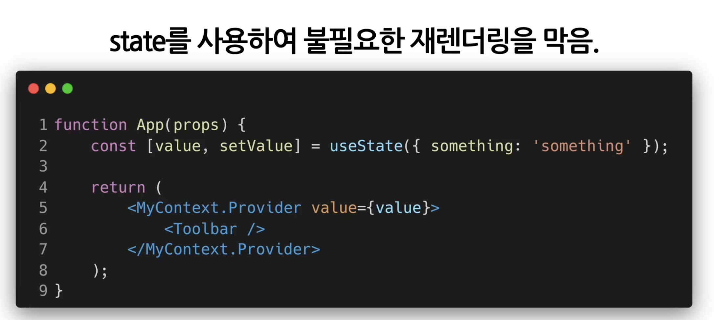

## Context

<br/>

- ### 기존방식
  - ex)로그인 데이터 같은경우 데이터 전달을 계속 해야한다
  

<br/>

  ```javascript
  function App(props) {
    return <Toolbar theme="dark" />;
  }

  function Toolbar(props) {
    //이 Toolbar 컴포넌트는 ThemedButton에 theme를 넘겨주기 위해서 'theme' prop을 가져야만 한다
    //현재 테마를 알아야 하는 모든 버튼에 대해서 props로 전달하는 것은 매우 비효율 적이다
    return (
      <div>
        <ThemedButton theme={props.theme} />
      </div>
    );
  }

  function ThemeButton(props) {
    return <Button theme={props.theme} />;
  }
  ```

<br/>

- ### Context
  - 컴포넌트의 props를 통해 데이터를 전달하는 대신 <br> 컴포넌트 트리를 통해 곧바로, 컴포넌트에게 전달
  - 다른 level에 컴포넌트가 특정 데이터를 필요로 하는 경우에 자주 사용

  

<br/>

  ```javascript
  //컨텍스트는 데이터를 매번 컴포넌트를 통해 전달할 필요 없이 컴포넌트 트리로 곧바로 전달하게 해준다
  // 여기에서는 현재 테마를 위한 컨텍스트를 생성하며, 기본값이 'light'이다
  const ThemeContext = React.createContext('light');


  // Provider를 사용하여 하위 컴포넌트들에게 현재 테마 데이터를 전달해준다
  // 모든 하위 컴포넌트 트리 하단에 얼마나 깊이 있는지에 관계없이 데이터를 읽을 수 있다
  // 여기에서는 현재 테마값으로 'dark'를 전달하고 있다
  function App(props) {
    return (
      <ThemeContext.Provider value="dark">
        <Toolbar />
      </ThemeContext.Provider>
    );
  }

  // 이제 중간에 위치한 컴포넌트는 테마 데이터를 하위 컴포넌트로 전달할 필요가 없다
  function Toolbar(props) {
    return (
      <div>
        <ThemeButton />
      </div>
    );
  }

  function ThemeButton(props) {
    //리액트는 가장 가까운 상위 테마 Provider를 찾아서 해당되는 값을 사용한다
    // 만약 해당되는 Provider가 없을 경우 기본값(여기에서는 'light')를 사용한다
    // 여기에서는 상위 Provider가 있기 때문에 현재 테마의 값은 'dark'가 된다
    return (
      <ThemeContext.Consumer>
        {value => <Button theme={value} />}
      </ThemeContext.Consumer>
    )
  }
  ```

<br/>

- ### Context가 언제 접근해야 할까?
  - 여러개의 Component들이 접근해야 하는 데이터
  - 로그인 여부, 로그인 정보, UI테마, 현재 언어 등...

    
<br/>

- ### 다른 예제코드(Context 사용 x)
  - 사용자 정보와 `avatarsize`를 몇단계에 걸쳐서 하위 컴포넌트로 전달한다
    - 
  - -> avatar component를 변수에 넣어 전달하는 방법<br> `element variable 형태`
    - 


<br/>

- ### Context API (리액트에서 제공)  

  - Context생성(가장 먼저 해야할 일)
    - `const MyContext = React.createContext(기본값);`
    - 만약 상위 레벨에 매칭되는 Provider가 없다면 기본값이 사용됨
    - 기본값으로 `undefined`를 넣으면 기본값이 사용되지 않음  


  - Context.Provider (2)
    - 하위 컴포넌트들이 해당 Context 데이터를 받을 수 있도록 설정하는 것
    - `<MyContext.Provider value={/* some value*/}>`
    - `value`라는 `prop`이 존재하며, 이것은 Provider컴포넌트 하위의 컴포넌트들에게 전달된다<br> 하위 컴포넌트들이 이 값을 사용하게 된다(이때 하위컴포넌트들을 `Consuming Component`라 한다)
      - `Consuming Component`들은 컨텍스트 값을 지켜보다가 만약 값이 변경되면 **재렌더링** 된다

    - 
      - 이유: value prop을 위한 새로운 객체가 매번 새롭게 생성되기 때문에
    - 

  - Class.contextType(클래스 컴포넌트 구독 = Consume)
    - 많이 사용 x

  - Context.Consumer(함수 컴포넌트 구독)
    - Context의 데이터를 구독하는 컴포넌트
    ```javascript
    <MyContext.Consumer>
      {value => /* 컨텍스트의 값에 따라서 컴포넌트들을 렌더링 */}
    </MyContext.Consumer>
    ```
    - 컴포넌트의 자식으로 함수가 올 수 있는데,이것을 `function as a child` 라 한다
    - Context.Consumer로 감싸주면 자식으로 들어가는 함수가 현재 컨텍스트의 value를 받아서 리액트 Node로 리턴<br> value = `Provider의 value prop`  

  - function as a child
    - 컴포넌트의 자식으로 함수를 사용하는 방법
    - **리액트에서는 기본적으로 하위 컴포넌트들을 children이라는 prop으로 전달해 주는데,<br> children으로 컴포넌트 대신 함수를 사용 가능**
    ``` javascript
    //childeren이라는 prop을 직접 선언하는 방식
    <Profile children = {name => <p>이름 : {name}</p>} />

    //Profile컴포넌트로 감싸서 children으로 만드는 방식
    <Profile>{name => <p>이름 : {name}</p>} </Provile>
    ```

  - Context.displayName
    - Context 객체는 displayName이라는 문자열 속성을 갖는다
    ```javascript
    const MyContext = React.createContext(초기값);
    MyContext.displayName = '별명'

    //개발자 도구에 "별명.Provider"으로 표시됨
    <별명.Provider>

    //개발자 도구에 "별명.Consumer"으로 표시됨
    <별명.Consumer>
    ```

  - 여러개의 Context 사용하기
    - Provider를 중첩하면 된다
    - 

  - useContext() (= 훅)
    - 함수컴포넌트에서 Context를 사용하기 위해 컴포넌트를 매번 Consumer컴포넌트로 감싸주는 것 보다 useContext() 훅 사용이 편리
    ``` javascript
    function MyComponent(props) {
      const value = useContext(MyContext) //createContext로 만든 MyContext 객체를 넣어야 한다

      return (
        ...
      )
    }
    ```
