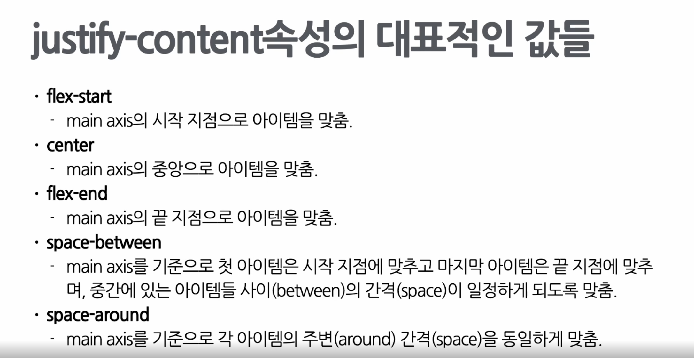

## Styling

<br/>

- ### CSS
  - 계단식(우선순위)
  - selector, style
  - 기본문법
    - 
  - Sass : CSS와 비슷하지만 별도의 문법을 이용해서 생산성이 높은 스타일 코드를 작성할 수 있게 도와준다.


- ### CSS 작성밥법
  - 일반적인 CSS파일로 작성하기
  - css-module로 작성하기
  - Sass로 작성하기
  - css-in-js로 작성하기(제일 많이 사용)
<br/>

- ### Selector의 유형
  - Element selector : 특정 HTML태그를 선택하기 위한 Element selector
    ``` css
    h1{ //h1태그 글자 색상을 녹색으로 바꾼다
      color: green;
    }
    ```

  - ID selector
    - ID가 section인 element를 정의한 HTML코드와<br> 해당 element의 배경 색깔을 검은색으로 바꾸기 위한 CSS 속성
    ```html
    <div id="section">
      ...
    </div>
    ```
    ```css
    #section {
      background-color: black;
    }
    ```

  - Class selector
    - 여러개의 element를 분류하기위해 사용
    - `.클래스명`
    ```html
    <span class="medium">
      ...
    </span>
    <p class="medium">
      ...
    </p>
    ```
    ``` css
    .medium {
      font-size: 20px;
    }
    p.medium {  //Element selector와 Class selector를 함께 사용한 예시
      font-size: 20px;
    }
    ```

  - Universal selector
    - 전체 Element에 적용
    ``` css
    * {
      font-size: 20px;
      color: blue;
    }
    ```

  - Grouping selector
    ```css
    h1, h2, p{
    color: black;
    text-align: center;
    }
    ```
  
  - Element의 상태와 관련된 selector
    - ex) 마우스 커서가 element위에 올라가거나 활성화 되어있는 상태
    - 

    ``` css
    button:hover {
      font-weight: bold;
    }
    a:active {
      color:red;
    }
    input:focus {
      color: #000000;
    }
    option:checked {
      background: #00ff00;
    }
    p:first-child {
      background: #ff0000;
    }
    p:last-child {
      background: #0000ff;
    }
    ```

<br/>

- ### Layout과 관련된 CSS 속성
  - 화면에 Element들을 어떻게 배치할 것인가? 
  - display
    - Element를 어떻게 표시할지 그 방법에 관한 속성
    ```css
    div {
      display: none | block | inline | flex;
    }
    ```
    - 

  - visibility
    - Element를 화면에 보여주거나 감추는 용도
    ```css
    div {
      visibility: visible | hidden;
    }
    ```
    - 

  - position
    - Element를 어떻게 위치시킬 것인지
    ```css
    div {
      position: static | fixed | relative | absolute;
    }
    ```
    - 

  - 가로,세로 길이와 관련된 CSS속성
    ``` css
    div {
      width: auto | value;
      height: auto | value;
      min-width: auto | value;
      min-height: auto | value;
      max-width: auto | value;
      max-height: auto | value;
    }
    ```

  - Flexbox
    - 다양한 레이아웃을 구성하기에 적합
    - Flexbox의 구성:  

    - 앞의 `display : flex`를 사용하면 Element가 flex container가 된다
    ``` css
    <!-- flex와 관련된 CSS 속성들 -->

    div { 
        display : flex;       //필수
        flex-direction : row | column | row-reverse | column-reverse;         //아이템들의 배치순서를 지정
        align-items: stretch | flex-start | center | flex-end | baseline;               //컨테이너 안에서의 아이템 정렬 (cross axis 기준)
        justify-content: flex-start | center | flex-end | space-between | space-around;   //아이템들을 어떻게 나란히 맞출 것 인지(main axis 기준)
    }
    ```
    
    
    
    
    
    
    

<br/>

- ### Font와 관련된 대표적인 속성
  ```css
  #title {
    font - family: "사용할 글꼴 이름", <일반적인 글꼴 분류>;
    font - size: value;
    font - weight: normal | bold;
    font - style : normal | italic | oblique;
  }
  ```

  - font-family
    - 어떤 글꼴을 사용할 것인지
    - 

  - font-size
    - 

  - font-weight
    - 

  - font-style
    - 글꼴의 스타일
    - 


- ### 기타많이 사용하는 CSS속성
  - background-color(뒷배경)
  - border(테두리)
