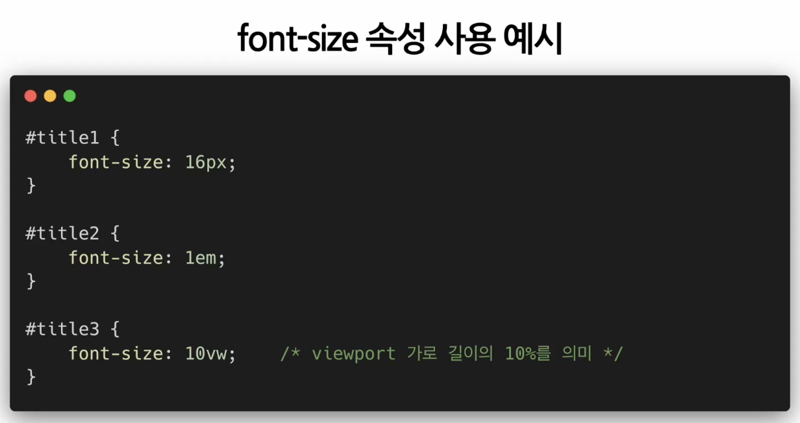
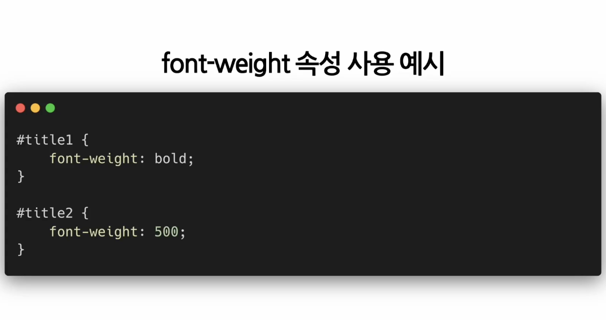
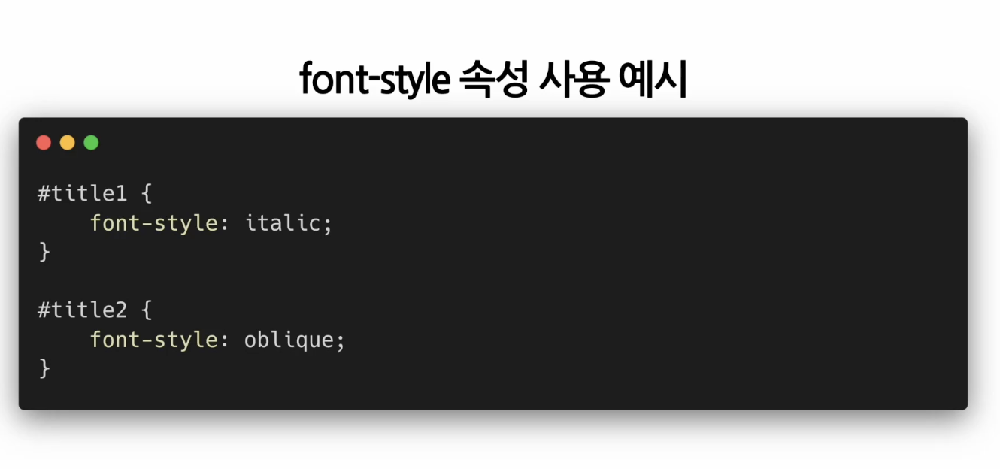
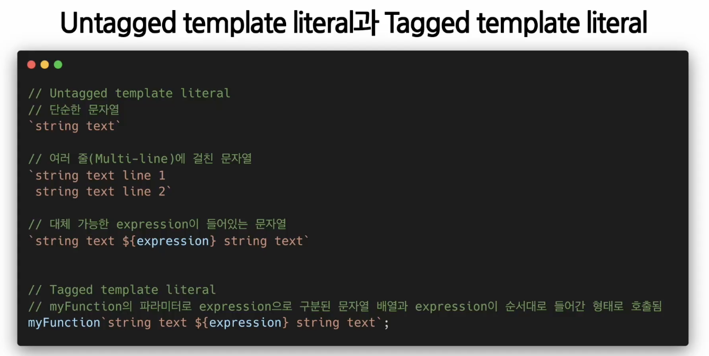
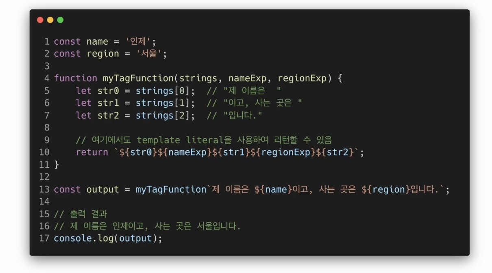

## Styling_2

- ### styled-components
  - **css문법을 그대로 사용하면서 결과물을 styling된 컴포넌트 형태로 만들어주는 오픈 소스 라이브러리**

  - 기본 사용법
    - literal(=상수x)
      - 정수 리터럴 : `const(상수) myNumber = 10(리터럴);`

    - template literal
      - 백틱스를 사용하여 문자열을 작성하고 그안에 대체가능한 expression을 넣는 방법이다
      - untagged, tagged literal:
        
      - tagged literal:
        

    - styled-components 는 tagged template literal를 사용하여 css속성이 적용된 react component를 만들어 준다
      - 

    - styled-components의 props 사용하기
      - 

    - styled-components의 스타일 확장하기
      - 

**`npm install --save styled-components` 해당 폴더 안에서 실행하기**