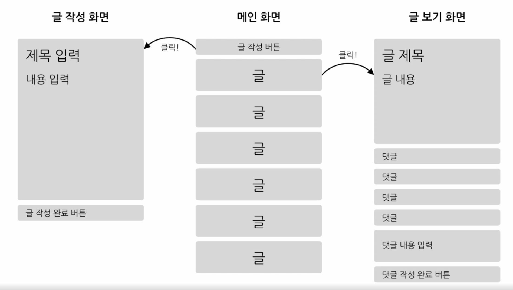
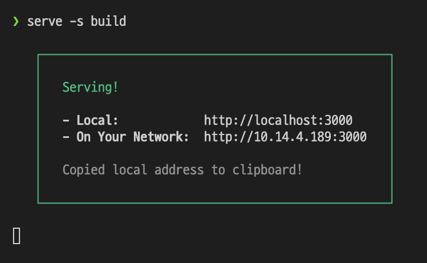

## MiniBlog

- ### function
  - 글 목록 보기 기능(리스트 형태)
  - 글 보기 기능
  - 댓글 보기 기능
  - 글 작성 기능
  - 댓글 작성 기능

<br/>

- ### UI 초본
  - 

<br>

- ### 필요한 패키지 설치
  - react-router-dom v6
    - 리액트 앱에서 페이지 전환을 위해서 사용하는 패키지(필수적)
    - ```javascript
      <BrowserRouter> // BrowerRouter컴포넌트 웹브라우저에서 리액트라우트를 사용하여 라우팅을 할수있게끔 해주는 컴포넌트 history를 이용하여 경로를 탐색할 수 있게끔 해준다
        <Routes>      
          <Route index element={<MainPage />} />
          <Route path="places" element= {<PlacePage />} />
          <Route path="games" element= {<GamePage />} />
        </Routes>
      </BrowserRouter>
      ```
  - styled-components v5
    - styling을 위한 라이브러리

  - `npm install --save react-router-dom styled-components`


- ### 각 기능에 필요한 Component
  - 글 목록 보기 기능(리스트 형태)
    - `PostList, PostListItem`

  - 글 보기 기능
    - `Post`
  
  - 댓글 보기 기능
    - `CommentList, CommentListItem`

  - 글 작성 기능
    - `PostWrite`
  
  - 댓글 작성 기능
    - `CommentWrite`


- ### 폴더 구성 하기
  - 


- ### bottom-up
  - ui 컴포넌트 구성
  - list 컴포넌트 구성
  - 가짜 데이터 만들기
    - 별도의 서버와 디비를 구축 x
  - page 컴포넌트 구성 및 페이지 별 경로 구성하기(App.js, index.js 수정)
  - 빌드와 배포하기
    - 코드와 애플리케이션이 사용하는 이미지, css파일 등의 파일을 모두 모아서 패키징 하는 과정
    - `npm run build` -> 빌드 폴더 내에는 html, css, js파일들이 들어있다(static폴더 내에)
  - (빌드)serve 설치(생성된 빌드파일을 이용해 웹 애플리케이션을 실행해 보겠다)
    - static파일들을 serve해주는 패키지
    - `npm install -g serve` //global 모드
    - 
  - (배포)
    - 빌드를 통해 생성된 정적인 파일들을 배포하려는 서버에 올리는 과정